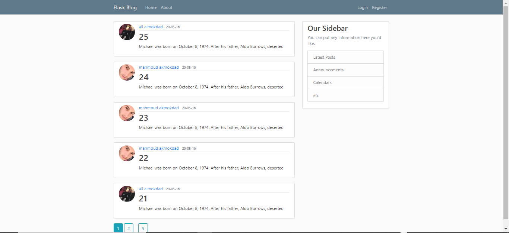
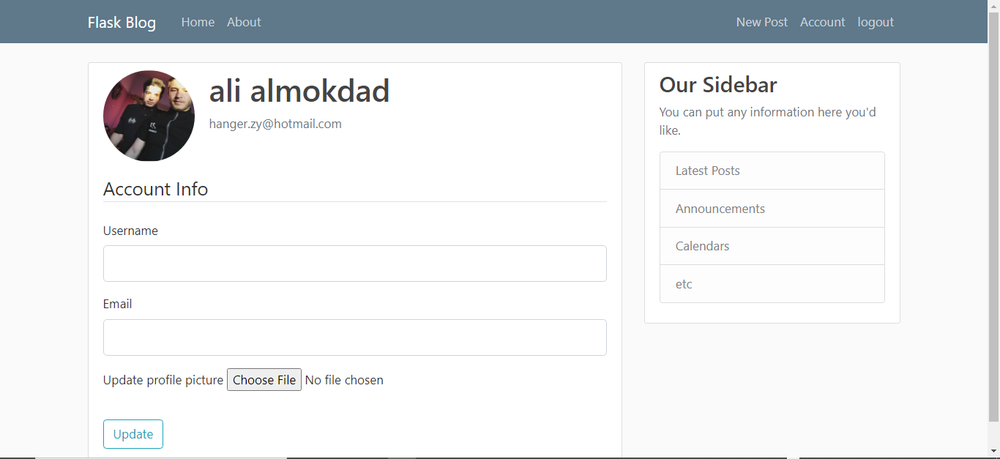
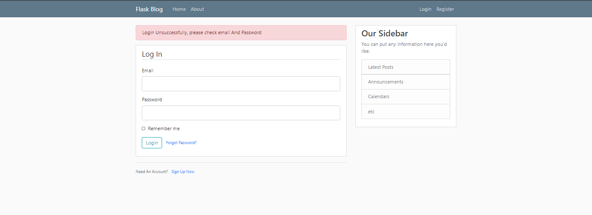
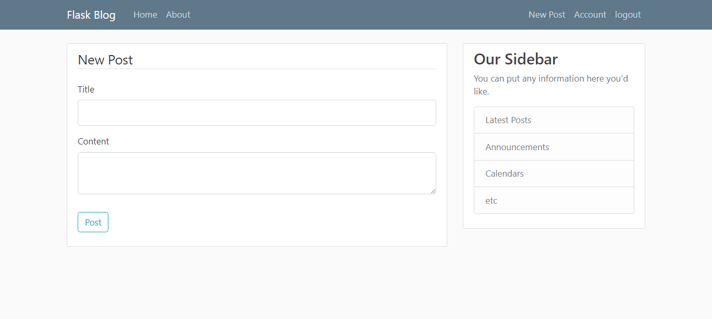

# Flask-Blog-imitation-twitter

 In this blog you can see code about social media site almost like Twitter, As you can Create User, Post, Delete, Update, etc...

<h3> You can see images below to know more about that: </h3>

